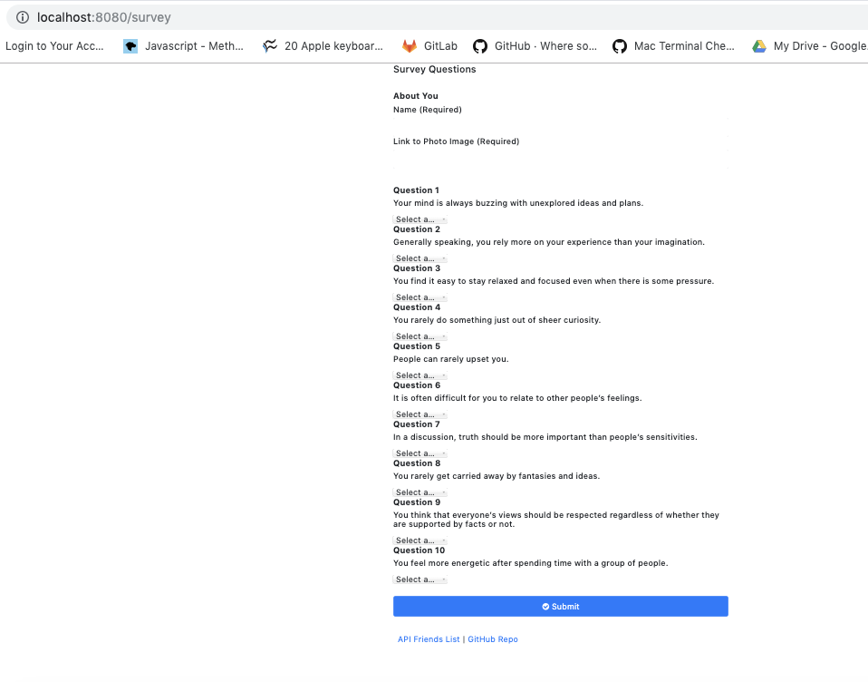
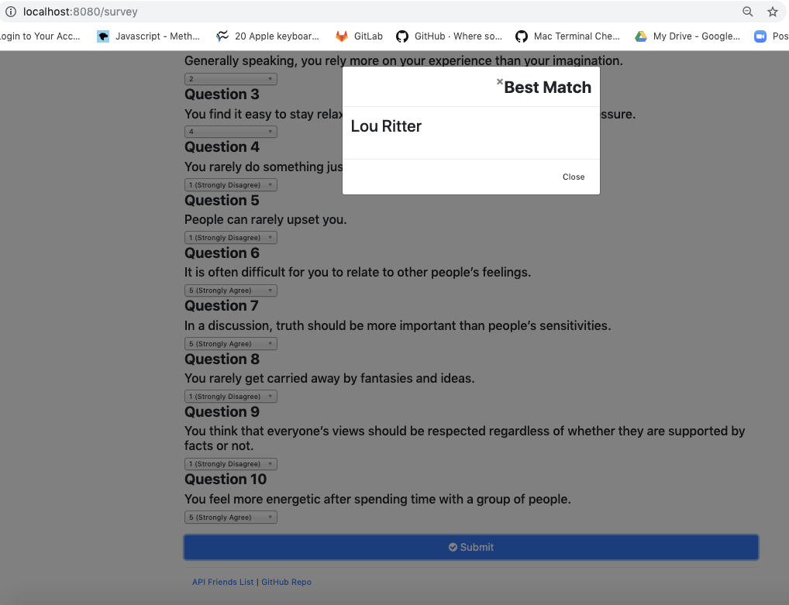
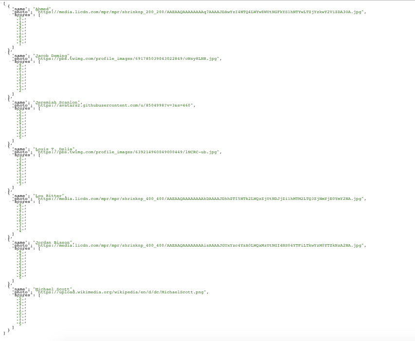

FriendFinder Application
Description:
FriendFinder implements friend matching based on the user's responses to a ten question survey. The user responds to questions with values from 1 (Strongly Disagree) to 5 (Strongly Agree). When the survey is submitted, an existing user record closest to the current user's responses is found and returned. The closest set of user responses is defined as the set with the lowest absolute difference for all ten questions combined.

FriendFinder application is meant to simulate a simple dating app. The application is implemented using a Node.js and Express server on the back end and the Materialize CSS framework on the front end.

Demo:
FriendFinder is deployed to Heroku. Please check the link here. https://badrivasistha-friendsfinder.herokuapp.com/

Installation:
To install the application follow the instructions below:

git clone git@github.com:https://github.com/badvasistha/FriendFinder.git
npm install -y
npm i express
Running Locally

After the PORT environment variable has been set, run the Node.js application with the command below.

node server.js
The application will now be running locally on PORT, in this case that is port 8080. You can then access it locally from your browser at the URL localhost:PORT, in this case localhost:8080.

Webpage Link:  https://badvasistha.github.io/FriendFinder/
Portfolio with the project link: https://badvasistha.github.io/Portfolio/

